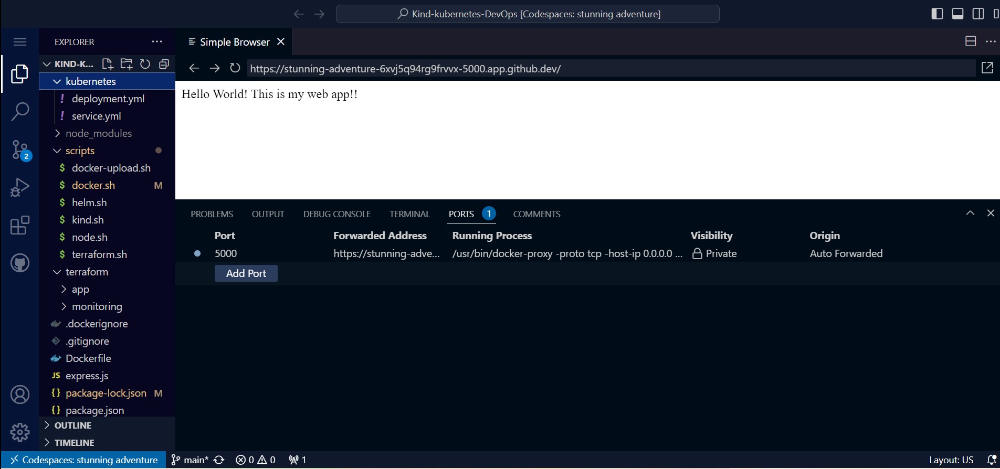

# Kind-kubernetes-DevOps
## *Project Overview*
The project revolves around the use of [kind](https://kind.sigs.k8s.io/docs/user/quick-start/), a tool that facilitates running Kubernetes on your local machine by employing specialized Docker containers as its building components. While its initial purpose was for Kubernetes testing, it has versatile applications, including local development and integration into continuous integration workflows.

**Project Tasks**

This project encompasses several tasks, starting with the setup of a Kubernetes cluster using Kind. It involves the creation of a local deployment script, deploying a Node.js application, creating a Docker image for a basic "Hello World" Express app, and securely storing the kubeconfig. Additionally, it entails crafting a Terraform script that leverages the kubectl provider to deploy the app to the Kind cluster. As a bonus, the project extends to establishing monitoring capabilities via the kube-prometheus stack using the Terraform Helm provider.
 
## **Environment Setup**

- Node (v20.6.1)
- Docker(v23.0.6)
- Kind (v0.11.1)
- Helm (v3.12.3)
- Terraform (v1.5.7)

Run the files(shell scripts) in the `scripts` folder at the root of the project to install the necessary dependencies and setting up the kubernetes kind cluster

**Standalone:**

Run the following commands:

```bash
$ node install express
$ node express.js
```

**Run in Docker:**

Replace the placeholders with your desired values and execute these commands:

```bash
$ docker build -t [IMAGE_NAME] .
$ docker run -p [PORT]:3000 [IMAGE_NAME]
```

**Access the Website**

You can access the website in two ways:

- **Browser**: Open your web browser and navigate to `localhost:[PORT]`.
- **Terminal**: Use the following command in your terminal: `curl localhost:[PORT]`.

**Push to Docker Hub:**

Edit the `dockerpath` and `user` variables in the `scripts/docker-upload.sh` file:

```bash
dockerpath=[IMAGE_NAME]
user=[DOCKER_USERNAME]
```

Then run the following command to push your Docker image to [Docker Hub](https://hub.docker.com/):

```bash
$ ./docker-upload.sh
```

**Deploy Manifest Files to a Kubernetes Kind Cluster Using [kubectl Terraform Provider](https://registry.terraform.io/providers/gavinbunney/kubectl/latest/docs)**

In the `kubernetes/service.yml` file, you can change the `port` property to your desired port:

```yaml
ports:
  - name: app-deployment
    protocol: TCP
    port: 5000 # Change this to your desired port
```

The `port` property specifies the port on which the reverse proxy will listen. In this configuration, the reverse proxy listens on port 5000. When a user visits a website hosted by the reverse proxy, it forwards the request to the target server, which listens on port 3000.

To view your website in the browser, you should enter the following URL:

[http://localhost:5000](http://localhost:5000)

The reverse proxy will then route the request to the target server, which is running on port 3000.

**How Reverse Proxy Works:**

Consider this illustration of how a reverse proxy functions:

```
+-----------------------+
| Reverse Proxy  (5000) |
+-----------------------+
            |
            |
+------------+------------+
|           |            |
|           |            |
|  Target   |  Target    |
|  Server 1 |  Server 2  |
|           |            |
+------------+------------+
```

The reverse proxy operates on a single port (e.g., port 5000) and redirects requests to different target servers based on specific rules it's configured with. In this scenario, the reverse proxy routes requests to different target servers based on URL paths.

Reverse proxies are frequently used to enhance website and web application performance and scalability. They can also bolster security by shielding target servers from direct internet access.

**Deploying with Terraform:**

Follow these steps to deploy the Node.js and kube-prometheus stacks into the Kubernetes kind cluster from both the `terraform/app` and `terraform/monitoring` directories:

1. Run `terraform init` in each directory to install required modules.

2. After initializing, use `terraform plan` to review the proposed changes.

3. To apply the changes, execute `terraform apply`.

**Deployment Status Checks:**

Monitor the deployment status by running the following commands:

- Check running deployments: `kubectl get deployments.app -n default --watch`.
  .png)

- Check running pods: `kubectl get pods -n default --watch`.
  .png)

- Check running services: `kubectl get svc -n default --watch`.
  .png)

**Port Forwarding:**

Port forwarding allows you to access your apps within the Kubernetes kind cluster for testing and issue resolution, while keeping them inaccessible to others on the internet.

**Accessing Node.js UI:**

To access the Node.js UI, use the following command:

```bash
$ kubectl port-forward svc/app-service 5000:3000 --namespace default
```


Open your web browser and visit: [http://localhost:5000/](http://localhost:5000/) to access the Node.js UI.

**Accessing Prometheus:**

Access Prometheus by running:

```bash
$ kubectl port-forward svc/kube-prometheus-stack-prometheus 5001:9090 --namespace default
```
.png)

Open your web browser and navigate to: [http://localhost:5001/](http://localhost:5001/) to access the Prometheus UI.

**Accessing Alertmanager:**

To access Alertmanager, utilize this command:

```bash
$ kubectl port-forward svc/kube-prometheus-stack-alertmanager 5002:9093 --namespace default
```
.png)

Open your web browser and go to: [http://localhost:5002/](http://localhost:5002/) to access the Alertmanager UI.

**Accessing Grafana:**

To access Grafana, execute the following:

```bash
$ kubectl port-forward svc/kube-prometheus-stack-grafana 5003:80 --namespace default
```
.png)
.png)

Open your web browser and visit: [http://localhost:5003/](http://localhost:5003/) to access the Grafana UI.

## 🔗 Contacts
**ONYEOCHA NWAMAKA FAVOUR**

[](https://www.linkedin.com/in/favour-onyeocha-829623205/)
[](https://wa.me/2348162370522)
[](https://twitter.com/OnyeochaF)

## Credits 

**[ignite.dev](https://www.linkedin.com/company/ignitedev/)**
